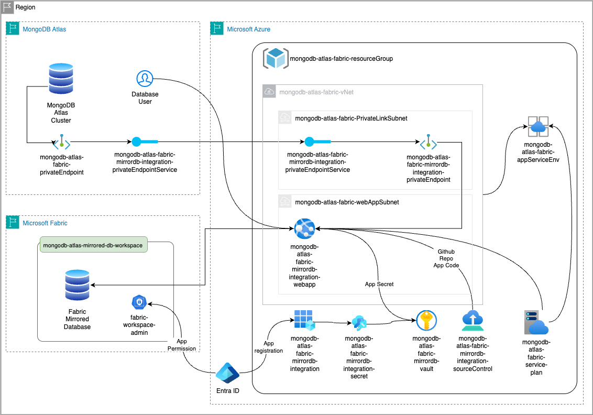
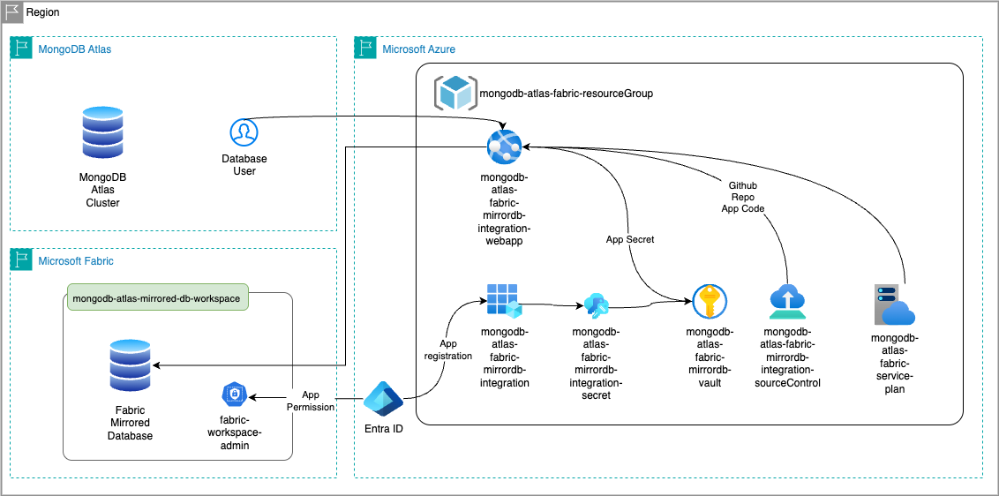

# MongoDB-Atlas-Mirroring-Terraform
MongoDB Atlas integration with Microsoft Fabric Mirrored Database.

This Terraform code automates the deployment of [MongoDB Fabric Integration](https://github.com/mongodb-partners/MongoDB_Fabric_Mirroring) solution developed by MongoDB Partners team. The resulting environment will have all resources required to synchronise a MongoDB database and collections with Microsoft Fabric Mirrored Database, allowing customers to use the features provided by Microsoft's service with the data stored on MongoDB Atlas.

There are two options to deploy the solution; with a private connection between Azure and MongoDB Atlas, and with public internet communication between the services. The former option will incur in additional costs due to the Azure SKU required for isolated environment, and the latter can be deployed using Free tier SKU.

MS Fabric provides a 60 days trial for the service. After this period, a [Fabric capacity](https://learn.microsoft.com/en-us/fabric/enterprise/buy-subscription) purchase will be required to continue using the service.

# Solution diagram #

## Integration with Private Endpoint ##


## Integration without Private Endpoint ##


## Pre-requistes ##

 - Terraform CLI [installed](https://developer.hashicorp.com/terraform/tutorials/aws-get-started/install-cli)
 - Azure AZ CLI [installed](https://learn.microsoft.com/en-us/cli/azure/install-azure-cli?view=azure-cli-latest) and configured to access the customer's environment.
 - MongoDB Atlas [API Keys](https://www.mongodb.com/docs/atlas/configure-api-access-project/#manage-programmatic-access-to-a-project) for terraform automation. The API Key should have `Organization Owener` or `Project Owner` permissions in order to [create the endpoint](https://www.mongodb.com/docs/atlas/security-private-endpoint/#required-access).
 - Running [MongoDB Atlas cluster](https://www.mongodb.com/docs/atlas/tutorial/create-new-cluster/#std-label-create-new-cluster) Azure provider, and all resources should be deployed on the same region.
 - Microsoft [Fabric Trial capacity](https://learn.microsoft.com/en-us/fabric/fundamentals/fabric-trial) pre-configured.
## Required variables ##

 The required variables required for the solution deployment are the following:
```
mongodbatlas_public_key         = "<Valid_Public_API_Key>"
mongodbatlas_private_key        = "<Valid_Private_API_Key>"
mongodbatlas_group_id           = "<MongoDB_Atlas_Project_ID>"
mongodbatlas_clustername        = "<MongoDB_Atlas_ClusterName>"
mongodbatlas_dbName             = "<MongoDB+Atlas_Database_name>"
mongodbatlas_userpass           = "<DBUser>:<Password>"
owner_tag                       = "<MongoDB_Username.Lastname>"
subscription_id                 = "<MongoDB_Azure_Subscrition_ID>"
azure_region                    = "australiacentral"
azure_vault_name                = ""
fabric_capacity_sku             = "<MS-Fabric-Capacity-SKU>"
```

 - MongoDB Atlas authentication keys as requested in the pre-requisites section
 - The Atlas Project ID can be found in Atlas UI -> Project Settings, or by using the `atlas project list` command
 - Atlas Clustername can be found in Atlas UI -> Clusters 
 - Atlas dbName is available in Atlas UI -> Data Explorer -> Cluster Name -> Connect
 - (Optional) The default value for mongodbatlas_collectionName is "All", but can be set for a specific collection
 - The `mongodbatlas_userpass` variable format is `username`:`password`
 - Owner tag for resource identification
 - Subscription ID can be obtained by running the `az login` command
 - `azure_vault_name`is optional and uses a random value by default
 - The Fabric Capacity SKU String can be found in Fabric's [Admin portal](https://app.fabric.microsoft.com/admin-portal/capacities/capacitiesList/trial?experience=fabric-developer) page.

Variables can be stored on the `terraform.tfvars` file, or provided when `terraform plan` is executed.

### Deploying without Secure network communication ###

To deploy the solution without the App Service Environment and with no Private Endpoints, add the following entries to the `terrraform.tfvars`, or provide the values when requested during the apply plan step:

```
deployPrivateEnvironment        = false
azure_sku_name                  = "F1"
```

The Azure SKU can be "F1" for free tier, or any other SKU listed on [Azure App Service on Windows pricing](https://azure.microsoft.com/en-us/pricing/details/app-service/windows/) page.

## Deployment procedure ##

 - Authenticate with ```az login```
 ```SHELL
az login
```

```SHELL
A web browser has been opened at https://login.microsoftonline.com/organizations/oauth2/v2.0/authorize. Please continue the login in the web browser. If no web browser is available or if the web browser fails to open, use device code flow with `az login --use-device-code`.

Retrieving tenants and subscriptions for the selection...

[Tenant and subscription selection]

No     Subscription name      Subscription ID                       Tenant
-----  ---------------------  ------------------------------------  -----------
[1] *  MyCompanySubscription  a1b2c3d4-e5f6-g7h8-i9j0-a1b2c3d4e5f6  example.com

The default is marked with an *; the default tenant is 'example.com' and subscription is 'MyCompanySubscription' (a1b2c3d4-e5f6-g7h8-i9j0-a1b2c3d4e5f6).

Select a subscription and tenant (Type a number or Enter for no changes): 

Tenant: mongodb.com
Subscription: MDB-TechnicalServices (a1b2c3d4-e5f6-g7h8-i9j0-a1b2c3d4e5f6)
```

Run `terraform plan --out plan_name.tfplan`, then `terraform apply "plan_name.tfplan"`. The deployment should take about 40 minutes to complete.

# Created Resources #

 The list below contains all resouces created by provider and service after deploying the solution based on the deployment option:
 
-  **With Private Endpoint**:

|Provider / Service|Resource Name|Resource Type|
|------------------|-------------|-------------|
|Microsoft Entra ID|mongodb-atlas-fabric-mirrordb-integration|App Registration|
|Microsoft Azure|mongodb-atlas-fabric-resourceGroup|Resource Group|
|Microsoft Azure|mongodb-atlas-fabric-asev3|App Service Environment|
|Microsoft Azure|mongodb-atlas-fabric-private-endpoint|Private endpoint|
|Microsoft Azure|mongodb-atlas-fabric-private-endpoint.nic|Network Interface|
|Microsoft Azure|mongodb-atlas-fabric-vNet|Virtual network|
|Microsoft Azure|vault-\[randomid\]|Key vault|
|Microsoft Azure|mongodb-atlas-fabric-service-plan|App Service plan|
|Microsoft Azure|mongodbatlasfabricmirrordbsynch|App Service|
|Microsoft Fabric|MongoDB Atlas Azure Fabric Mirrored Database Integration|Workspace|
|Microsoft Fabric|MongoDB Atlas - Fabric Mirrored Database|Mirrored Database|
|Microsoft Fabric|MongoDB Atlas - Fabric Mirrored Database|Semantic model (default)|
|Microsoft Fabric|MongoDB Atlas - Fabric Mirrored Database|SQL analytics endpoint|
|MongoDb Atlas|\*/providers/Microsoft.Network/privateLinkServices/\*|Dedicated Cluster Private Endpoint|

 - **Without Private Endpoint**

|Provider / Service|Resource Name|Resource Type|
|------------------|-------------|-------------|
|Microsoft Entra ID|mongodb-atlas-fabric-mirrordb-integration|App Registration|
|Microsoft Azure|mongodb-atlas-fabric-resourceGroup|Resource Group|
|Microsoft Azure|mongodb-atlas-fabric-service-plan|App Service plan|
|Microsoft Azure|mongodbatlasfabricmirrordbsynch|App Service|
|Microsoft Fabric|MongoDB Atlas Azure Fabric Mirrored Database Integration|Workspace|
|Microsoft Fabric|MongoDB Atlas - Fabric Mirrored Database|Mirrored Database|
|Microsoft Fabric|MongoDB Atlas - Fabric Mirrored Database|Semantic model (default)|
|Microsoft Fabric|MongoDB Atlas - Fabric Mirrored Database|SQL analytics endpoint|

# Deleting the deployed resources #

 The deployed solution can be deleted using the Terraform CLI  ```terraform destroy``` command, which will remove all resources from Fabric, Azure and MongoDB Atlas. The database will not be affected by this action.

 ```SHELL
 terraform destroy
.
. [List of resources to be destroyed]
.
Do you really want to destroy all resources?
  Terraform will destroy all your managed infrastructure, as shown above.
  There is no undo. Only 'yes' will be accepted to confirm.

  Enter a value: yes
```

 # Known issues #
- The Mirrored Database replication will not start automatically. After deployed the solutiom, go to the `MongoDB Atlas - Fabric Mirrored Database` workspace on [Microsoft Fabric](https://app.fabric.microsoft.com) and click on "Start replication" to enable the service.
- Usually Azure App Service Environment can take a long time to create and delete. Same for azurerm_service_plan resources.
- The mongodbatlas_privatelink_endpoint_service creation requires a stable MongoDB Atlas project. If there are pending automations, the resource creation will keep waiting for the environment to stabilise before proceeding to the next steps.
- Deploying the solution without App service environment and no endpoints will create a webapp instance with a random IP address from Microsoft's IP range. In order to allow the synchronization app to reach the MongoDB Atlas cluster, you will need to add the VM's outbound IP address to the Atlas Network Access list:
1. Go to Azure's Resource Group "mongodb-atlas-fabric-resourceGroup", and click on the "mongodbatlasfabricmirrordbsynch" App Service resource.
2. Open the "Development Tools / SSH" section from the left-side menu, and click in "Go ->" to open a terminal session on the VM server.
3. Run the `curl checkip.amazonaws.com` command to get the IP address being used by the VM to reach the internet
4. Add the IP address obtained on the MongoDB Atlas Network Access list
5. Back to the Azure App Service resource, go to "Overview" on the left-side menu, then click on "Restart" on the top-level menu to restart the VM.
6. Back on the SSH session, check the synch status using the `tail -f mirroring.log` and checking the activities registered in the log file.
